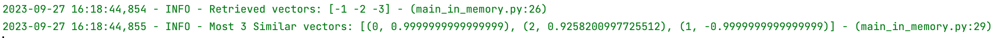

summary: TP Simple Vector DB
id: tp_simple_vector_db
categories: setup
tags: setup
status: Published
authors: OCTO Technology
Feedback Link: https://github.com/AurelienMassiot/simple_vector_db/issues/new

# TP - Implémenter une base de données vecteurs from scratch

## Vue d'ensemble

Duration: 0:01:00

L'objectif de ce TP est créer une simple base de données de vecteurs, comme décrit dans notre article ["Sous le capot des bases de données vectorielles"](https://blog.octo.com/sous-le-capot-des-bases-de-donnees-vectorielles-(vector-databases)).

Bien évidemment, le but ici n'est pas de créer une base de données performante utilisable en production, mais plutôt de l'implémenter pas à pas pour en décortiquer chaque brique.  

N'hésitez pas à vous référer à l'article pour mieux comprendre les concepts implémentés, ou à regarder le [repository complet](https://github.com/AurelienMassiot/simple_vector_db) pour voir l'implémentation finale.

A noter que des tests unitaires ont été implémentés dans le repository, mais nous n'allons pas les recoder dans le TP. Libre à vous d'aller les voir sur la branche `main` et de les ajouter à votre implémentation ;-).  

Pour référence, l'arborescence finale doit ressembler à ceci :
```texte simple
    .
    └── simple_vector_db
        ├── simple_vector_db
        | ├── quantization
        | | ├── __init__.py
        | | ├── vector_quantizer.py
        | ├── __init__.py
        | ├── distances.py
        | ├── numpy_array_adapter.py
        | ├── vector_db_in_memory.py
        | ├── vector_db_sqlite.py
        | ├── vector_db_sqlite_pq.py
        ├── utils
        | ├── flex_logging.py
        main_in_memory.py
        main_quantizer.py
        main_sqlite.py
        main_sqlite_pq.py
        poetry.lock
        pyproject.toml
```


## Installation des dépendances
Dans un premier temps, nous allons installer le dépendances nécessaires à notre projet. Pour cela, installez `scikit-learn`, `numpy`, `sqlalchemy`,  `matplotlib`, `dataget` dans votre environnement Python. Il y a plusieurs façons de le faire : Conda, Pipenv, Poetry, etc. Libre à vous d'utiliser la méthode que vous préférez. Ici, nous allons utiliser Poetry en créant un fichier `pyproject.toml` et en y ajoutant les dépendances nécessaires :

```toml
# pyproject.toml
[tool.poetry]
name = "simple-vector-db"
version = "0.1.0"
description = ""
authors = ["Aurelien Massiot <aurelien.massiot@octo.com>", "Philippe Stepniewski <philippe.stepniewski@octo.com>"]
readme = "README.md"
packages = [{include = "simple_vector_db"}]

[tool.poetry.dependencies]
python = "^3.9"
scikit-learn = "^1.3.0"
sqlalchemy = "^2.0.20"
matplotlib = "^3.8.0"
dataget = "^0.4.15"


[tool.poetry.group.dev.dependencies]
pytest = "^7.4.1"
black = "^23.7.0"

[build-system]
requires = ["poetry-core"]
build-backend = "poetry.core.masonry.api"
```

Ensuite, un `poetry install` devrait installer les dépendances nécessaires dans votre environnement Python, `poetry shell` devrait vous permettre d'activer votre environnement.

## Calcul de distances entre les vecteurs

Pour calculer des distances entre les vecteurs, il existe plusieurs méthodes et nous allons en implémenter deux : la distance euclidienne et la similarité cosinus. Pour cela, commençons par créer un fichier `distances.py`.
Les méthodes `cosine_similarity` et `euclidean_distance` prennent toutes les deux en entrée deux vecteurs et retournent un nombre entre 0 et 1. Plus ce nombre est proche de 1, plus les vecteurs sont similaires.

```python
# simple_vector_db/distances.py
import numpy as np

def cosine_similarity(v1: np.ndarray, v2: np.ndarray) -> float:
    dot_product = np.dot(v1, v2)
    norm_v1 = np.linalg.norm(v1)
    norm_v2 = np.linalg.norm(v2)
    return dot_product / (norm_v1 * norm_v2)


def euclidean_distance(v1: np.ndarray, v2: np.ndarray) -> float:
    return np.linalg.norm(v1 - v2)
```

## Implémentation d'une base de données vecteurs en mémoire
Maintenant que nous avons des méthodes pour calculer des distances entre vecteurs, nous allons implémenter une base de données vecteurs en mémoire. Pour cela, nous allons créer un fichier `simple_vector_db/vector_db_in_memory.py` et y créer une classe `InMemoryVectorDB`.  

Ici, nous implémentons les méthodes `insert`, `search` et `retrieve` en utilisant un dictionnaire python pour stocker les vecteurs. La clé de chaque vecteur est son index dans le dictionnaire.  

Pour chercher les vecteurs les plus proches d'une requête, nous calculons la distance entre la requête et tous les vecteurs de la base de données, puis nous trions les résultats par ordre décroissant de distance et nous ne gardons que les `k` premiers. Il est donc possible ici d'utiliser la distance eucliennne ou la similarité cosinus.

```python
#simple_vector_db/vector_db_in_memory.py
from collections import defaultdict
from typing import List, Tuple

import numpy as np

from simple_vector_db.distances import cosine_similarity

class VectorDBInMemory():
    def __init__(self):
        self.vectors = defaultdict(np.ndarray)

    def insert(self, vectors: list[np.ndarray]) -> None:
        for i in range(len(vectors)):
            self.vectors[i] = vectors[i]

    def search(self, query_vector: np.ndarray, k: int) -> List[Tuple[str, float]]:
        similarities = [
            (key, cosine_similarity(query_vector, vector))
            for key, vector in self.vectors.items()
        ]
        # similarities = [(key, euclidean_distance(query_vector, vector)) for key, vector in self.vectors.items()]
        similarities.sort(key=lambda x: x[1], reverse=True)
        return similarities[:k]

    def retrieve(self, key: int) -> np.ndarray:
        return self.vectors.get(key, None)
```

## Ajout de logging
Pour pouvoir suivre l'exécution de notre code, nous allons ajouter un peu de logging coloré (copyright à notre cher [Octo Thomas](https://github.com/AnOtterGithubUser)) . Pour cela, nous allons créer un fichier `utils/flex_logging.py` et y créer un handler qui permettra d'afficher les logs dans la console. C'est clairement un nice-to-have, mais autant faire les choses bien :

```python
# utils/flex_logging.py
import logging
import sys


class CustomFormatter(logging.Formatter):
    green = "\x1b[32m"
    yellow = "\x1b[33m"
    red = "\x1b[31;20m"
    reset = "\x1b[0m"
    format = "%(asctime)s - %(levelname)s - %(message)s - (%(filename)s:%(lineno)s)"

    FORMATS = {
        logging.INFO: green + format + reset,
        logging.WARNING: yellow + format + reset,
        logging.ERROR: red + format + reset,
    }

    def format(self, record):
        log_fmt = self.FORMATS.get(record.levelno)
        formatter = logging.Formatter(log_fmt)
        return formatter.format(record)


stream_handler = logging.StreamHandler(sys.stdout)
stream_handler.setLevel(logging.INFO)
stream_handler.setFormatter(CustomFormatter())
```


## Test de l'implémentation de la base de données vecteurs en mémoire
Maintenant que nous avons implémenté notre première base de données vecteurs, testons la. Nous allons créer un fichier `main_in_memory.py` dans lequel nous allons pouvoir tester notre implémentation.

Pour cela, nous allons créer une base de données vecteurs en mémoire, y insérer 3 vecteurs sous forme de numpy array, en retrouver un par sa clé et chercher les k vecteurs les plus similaires de notre vecteur requête.
N'hésitez pas à changer les valeurs des vecteurs (les vecteurs insérés `vectors_to_insert` au préalable et le vecteur de requête `QUERY_VECTOR`).

Notez l'import de notre librairie de logging et l'utilisation de notre handler `stream_handler` pour afficher les logs dans la console.

A ce stade, l'arborescence de notre projet devrait ressembler à cela :

```texte simple
    .
    └── simple_vector_db
        ├── simple_vector_db
        | ├── __init__.py
        | ├── distances.py
        | ├── vector_db_in_memory.py
        ├── utils
        | ├── flex_logging.py
        poetry.lock
        pyproject.toml
        main_in_memory.py
```

```python
# main_in_memory.py
import logging

import numpy as np

from simple_vector_db.vector_db_in_memory import VectorDBInMemory
from utils.flex_logging import stream_handler

logger = logging.getLogger(__name__)
logger.addHandler(stream_handler)
logger.setLevel(logging.INFO)

vector_db = VectorDBInMemory()
QUERY_VECTOR = np.array([0.1, 0.2, 0.3])
K_SIMILAR_VECTORS = 3


def perform_search_in_memory():
    vectors_to_insert = [
        np.array([10, 20, 30]),
        np.array([-1, -2, -3]),
        np.array([0.3, 0.3, 0.3]),
    ]
    vector_db.insert(vectors_to_insert)

    retrieved_vector = vector_db.retrieve(1)
    logger.info(f"Retrieved vectors: {retrieved_vector}")

    similar_vectors = vector_db.search(query_vector=QUERY_VECTOR, k=K_SIMILAR_VECTORS)
    logger.info(f"Most {K_SIMILAR_VECTORS} Similar vectors: {similar_vectors}")


if __name__ == "__main__":
    perform_search_in_memory()
```

Et tadaaa !  
Nous pouvons voir que les k vecteurs les plus similaires ont été retournés, ordonnés par ordre décroissant de similarité.



Nous allons désormais passer aux choses sérieuses et implémenter une base de données vecteurs persistante.

## Ajout d'un décorateur pour mesurer le temps d'exécution
Avant d'implémenter notre base de données persistante, nous allons d'abord créer un petit utilitaire nous permettant de mesurer le temps d'exécution de nos méthodes. Pour cela, nous allons créer un fichier `utils/timer.py` et y créer un décorateur `timer` qui prend en entrée une fonction et retourne une fonction qui mesure le temps d'exécution de la fonction passée en entrée.  
Créez un fichier `utils/timing.py` et implémentez le décorateur `timer` :

```python
# utils/timing.py
import logging
import time
from functools import wraps

from utils.flex_logging import stream_handler

logger = logging.getLogger(__name__)
logger.addHandler(stream_handler)
logger.setLevel(logging.INFO)


def timeit(func):
    @wraps(func)
    def timeit_wrapper(*args, **kwargs):
        start_time = time.perf_counter()
        result = func(*args, **kwargs)
        end_time = time.perf_counter()
        total_time = end_time - start_time
        logger.info(
            f"Function {func.__name__}{args} {kwargs} Took {total_time:.4f} seconds"
        )
        return result

    return timeit_wrapper
```

## Premiers objets avec SQLite et SQLAlchemy
Nous allons maintenant créer une base de données SQLite avec SQLAlchemy. SQLAlchemy va grandement nous faciliter la tâche en tant qu'ORM. Pour cela, nous allons créer un fichier `simple_vector_db/vector_db_sqlite.py` et y créer une classe `VectorDBSQLite`.  
L'initialisation de cet objet va nous permettre d'instancier la connexion à la base de données SQLite : 

```python
# simple_vector_db/vector_db_sqlite.py

import sqlite3
from sqlalchemy import create_engine
from sqlalchemy.orm import declarative_base
from sqlalchemy.orm import sessionmaker
from simple_vector_db.distances import cosine_similarity, euclidean_distance

Base = declarative_base()

class VectorDBSQLite():
    def __init__(self, db_filename: str):
        self.engine = create_engine(f"sqlite:///{db_filename}", connect_args={'detect_types': sqlite3.PARSE_DECLTYPES})
        Base.metadata.create_all(self.engine)
        Session = sessionmaker(bind=self.engine)
        self.session = Session()
        self.metric = {"metric": cosine_similarity, "reverse_sort": True}

    def set_metric(self, metric_name: str = "cosine"):
        if metric_name == "cosine":
            self.metric["metric"] = cosine_similarity
            self.metric["reverse_sort"] = True
        elif metric_name == "euclidean":
            self.metric["metric"] = euclidean_distance
            self.metric["reverse_sort"] = False
```

Dans ce même fichier, nous allons ajouter  une classe Vector qui va nous permettre de représenter un vecteur dans notre base de données. Cette classe va hériter de la classe `Base` de SQLAlchemy et va contenir un attribut `id` qui sera la clé primaire de notre table et un attribut `vector` qui sera le vecteur stocké dans la base de données.  

```python

from sqlalchemy import  Column, Integer
from simple_vector_db.numpy_array_adapter import NumpyArrayAdapter

class Vector(Base):
    __tablename__ = "vectors"

    id = Column(Integer, primary_key=True)
    data = Column(NumpyArrayAdapter)

    def __init__(self, data):
        self.data = data
```

Nous pouvons voir qu'ici, notre vecteur est de type NumpyArrayAdapter, et qu'il est importé depuis `simple_vector_db.numpy_array_adapter`. Ce fichier n'existe pas ? C'est normal, nous allons le créer tout de suite.  

## Implémentation d'un adaptateur SQLite pour les vecteurs Numpy
Il n'est pas possible de base de stocker des vecteurs Numpy dans une base de données SQLite. Pour cela, nous allons créer un adaptateur qui va nous permettre de convertir nos vecteurs Numpy en un type que SQLite peut stocker. Pour cela, nous allons créer un fichier `simple_vector_db/numpy_array_adapter.py` et y créer une classe `NumpyArrayAdapter` qui va hériter de la classe `types.TypeDecorator` de SQLAlchemy.  

```python
# simple_vector_db/numpy_array_adapter.py

import numpy as np
from sqlalchemy import types


class NumpyArrayAdapter(types.TypeDecorator):
    impl = types.LargeBinary

    def process_bind_param(self, value, dialect):
        if value is not None:
            return value.tobytes()

    def process_result_value(self, value, dialect):
        if value is not None:
            return np.frombuffer(value, dtype=np.float64)
```

## Création de la méthode d'insertion des vecteurs

Nous allons désormais pouvoir insérer des vecteurs dans notre base de données. Pour cela, nous allons ajouter une méthode `insert` à notre classe `VectorDBSQLite`. Cette méthode va prendre en entrée une liste de vecteurs et va les insérer dans la base de données.  

```python
# simple_vector_db/vector_db_sqlite.py

import numpy as np
class VectorDBSQLite():
    ... 
    
    def insert(self, vectors: list[np.ndarray], vector_ids: list[int] = None) -> None:
        vector_objects = [Vector(data=array) for array in vectors]
        self.session.add_all(vector_objects)
        self.session.commit()
```

On peut créer un script `main_sqlite.py` pour tester une insertion. Nous allons créer une base de données SQLite dans un fichier `vector_db.db` et y insérer 1000 vecteurs de dimension (1, 3).  

```python
# main_sqlite.py

import numpy as np
from simple_vector_db.vector_db_sqlite import VectorDBSQLite

DB_FILENAME = "vector_db.db"
vector_db = VectorDBSQLite(db_filename=DB_FILENAME)

N_VECTORS = 1000
VECTORS_SHAPE = (1, 3)

def insert_vectors(n_vectors: int, vectors_shape: tuple[int, int]) -> None:
    vectors_to_insert = [np.random.rand(*vectors_shape) for _ in range(n_vectors)]
    vector_db.insert(vectors_to_insert)

if __name__ == "__main__":
    insert_vectors(N_VECTORS, VECTORS_SHAPE)
```

## Création de la méthode de recherche des vecteurs les plus similaires

Nous allons maintenant implémenter la méthode `search` de notre classe `VectorDBSQLite`. Cette méthode va prendre en entrée un vecteur de requête et un nombre `k` et va retourner les `k` vecteurs les plus similaires à la requête.  

```python
# simple_vector_db/vector_db_sqlite.py
from typing import List, Tuple
from simple_vector_db.distances import cosine_similarity

class VectorDBSQLite():
    ...
    
    def search_without_index(
            self, query_vector: np.ndarray, k: int
    ) -> List[Tuple[int, float]]:
        vectors = self.session.query(Vector).all()
        similarities = [
            (vector.id, self.metric["metric"](query_vector, vector.data))
            for vector in vectors
        ]
        similarities.sort(key=lambda x: x[1], reverse=self.metric["reverse_sort"])
        top_similarities = similarities[:k]

        return top_similarities
```

De même que tout à l'heure avec l'implémentation en mémoire, il est possible de changer la distance utilisée pour la recherche. Ici, nous utilisons la similarité cosinus.

## Test de l'implémentation de la base de données vecteurs SQLite sans index 
Nous pouvons retourner sur notre fichier `main_sqlite.py` et tester la recherche de vecteurs similaires. Pour cela, nous allons utiliser le décorateur `timeit` que nous avons créé plus tôt pour mesurer le temps d'exécution de la recherche, car nous comparerons cette recherche sans index avec une recherche avec index, que nous créerons par la suite.  

Pour rendre l'exécution reproductible, nous supprimons le fichier `vector_db.db` à la fin de l'exécution du script. N'hésitez pas à ajouter une seed pour rendre l'exécution idempotente.

```python
# main_sqlite.py

import logging
import shutil
import numpy as np
from simple_vector_db.vector_db_sqlite import VectorDBSQLite
from utils.flex_logging import stream_handler
from utils.timing import timeit


logger = logging.getLogger(__name__)
logger.addHandler(stream_handler)
logger.setLevel(logging.INFO)

DB_FILENAME = "vector_db.db"
vector_db = VectorDBSQLite(db_filename=DB_FILENAME)

N_VECTORS = 1000
VECTORS_SHAPE = (1, 3)
QUERY_VECTOR = np.array([0.15, 0.25, 0.35])
K_SIMILAR_VECTORS = 5

def insert_vectors(n_vectors: int, vectors_shape: tuple[int, int]) -> None:
    vectors_to_insert = [np.random.rand(*vectors_shape) for _ in range(n_vectors)]
    vector_db.insert(vectors_to_insert)

@timeit
def perform_search_without_index():
    similar_vectors = vector_db.search_without_index(QUERY_VECTOR, k=K_SIMILAR_VECTORS)
    logger.info(f"Most {K_SIMILAR_VECTORS} Similar vectors: {similar_vectors}")

if __name__ == "__main__":
    insert_vectors(N_VECTORS, VECTORS_SHAPE)
    perform_search_without_index()
    shutil.os.remove(DB_FILENAME)
```

Vous pouvez désormais lancer le script et voir le temps d'exécution de la recherche sans index. N'hésitez pas à changer les valeurs du vecteur de requête, les dimensions, le nombre de vecteurs similaires à retourner, etc.

## Création d'un index pour accélérer la recherche des vecteurs les plus similaires
Nous allons désormais créer un index pour accélérer la recherche des vecteurs les plus similaires.

Pour cela, nous allons ajouter une méthode `create_kmeans_index` à notre classe `VectorDBSQLite`. Cette méthode va créer des clusters avec la méthode Kmeans en se basant sur la colonne `data` de nos vecteurs.  

```python
# simple_vector_db/vector_db_sqlite.py
from sklearn.cluster import KMeans

class VectorDBSQLite():
    ...
    def create_kmeans_index(self, n_clusters: int) -> np.ndarray:
        vectors = self.session.query(Vector).all()
        vector_arrays = [vector.data for vector in vectors]

        kmeans = KMeans(n_clusters=n_clusters, random_state=0, n_init="auto")
        kmeans.fit_predict(vector_arrays)
        centroids = kmeans.cluster_centers_

        self.insert_centroids(centroids)
        self.insert_indexed_vectors(vector_arrays, kmeans.labels_)

        return centroids


```

Il faut donc créer deux nouvelles méthodes `insert_centroids` et `insert_indexed_vectors` qui vont insérer les centroids et les vecteurs indexés dans la base de données.  
Créons d'abord deux nouvelles classes Centroid et IndexedVector. Les centroïdes ont un id et des coordonnées ; les vecteurs indexés ont un id, des coordonnées et un cluster d'appartenance.  

```python
# simple_vector_db/vector_db_sqlite.py

class Centroid(Base):
    __tablename__ = "centroids"

    id = Column(Integer, primary_key=True)
    data = Column(NumpyArrayAdapter)

    def __init__(self, id, data):
        self.id = id
        self.data = data


class IndexedVector(Base):
    __tablename__ = "indexed_vectors"

    id = Column(Integer, primary_key=True)
    data = Column(NumpyArrayAdapter)
    cluster = Column(Integer)

    def __init__(self, data, cluster):
        self.data = data
        self.cluster = cluster
```

Les méthodes `insert_centroids` et `insert_indexed_vectors` de la classe VectorDBSQLite sont assez similaires à la méthode `insert` que nous avons implémentée plus tôt.

```python
# simple_vector_db/vector_db_sqlite.py

class VectorDBSQLite():
    ...
    def insert_centroids(self, centroids) -> None:
        centroid_objects = [
            Centroid(id=id, data=centroid_coordinates)
            for id, centroid_coordinates in enumerate(centroids)  # because centroids id have to start at O
        ]
        self.session.add_all(centroid_objects)
        self.session.commit()

    def insert_indexed_vectors(self, vectors, clusters) -> None:
        indexed_vector_objects = [
            IndexedVector(
                data=vector_coordinates, cluster=int(cluster)
            )
            for vector_coordinates, cluster in zip(vectors, clusters)
        ]
        self.session.add_all(indexed_vector_objects)
        self.session.commit()
```

## Création de la méthode de recherche des vecteurs les plus similaires avec index

Nous allons désormais pouvoir implémenter la méthode `search_in_kmeans_index` de notre classe `VectorDBSQLite`. Cette méthode va prendre en entrée un vecteur de requête et un nombre `k` et va retourner les `k` vecteurs les plus similaires à la requête.  

Il suffit alors de requêter la base de données pour récupérer les centroïdes, de trouver le centroïde le plus proche de la requête, de récupérer les vecteurs indexés appartenant à ce cluster et de calculer la similarité entre la requête et ces vecteurs.  

```python
# simple_vector_db/vector_db_sqlite.py
class VectorDBSQLite():
    ...
    def search_in_kmeans_index(
            self, query_vector: np.ndarray, k: int, n_probes=1
    ) -> Tuple[List[Tuple[int, float]], int]:
        centroids = self.session.query(Centroid).all()
        most_similar_centroid_id = self.find_most_similar_centroid(
            query_vector, centroids, n_probes=n_probes
        )

        indexed_vectors = (
            self.session.query(IndexedVector)
            .filter(IndexedVector.cluster.in_(most_similar_centroid_id))
            .all()
        )
        similarities = [
            (indexed_vector.id, self.metric["metric"](query_vector, indexed_vector.data))
            for indexed_vector in indexed_vectors
        ]

        similarities.sort(key=lambda x: x[1], reverse=self.metric["reverse_sort"])
        most_similar_vectors = similarities[:k]

        return most_similar_vectors, most_similar_centroid_id

    def find_most_similar_centroid(self, query_vector, centroids, n_probes=1) -> list:
        centroid_similarities = [
            (centroid.id, self.metric["metric"](query_vector, centroid.data))
            for centroid in centroids
        ]
        centroid_similarities.sort(key=lambda x: x[1], reverse=self.metric["reverse_sort"])
        most_similar_centroid_ids = self.subset_most_similar_centroids(centroid_similarities,n_probes=n_probes)
        return most_similar_centroid_ids
    
    @staticmethod
    def subset_most_similar_centroids(centroids_similarities, n_probes=1):
        most_similar_centroid_ids = [tuple[0] for tuple in centroids_similarities[:n_probes]]
        return most_similar_centroid_ids

```

## Test de l'implémentation de la base de données vecteurs SQLite avec index

Retournons désormais dans notre fichier `main_sqlite.py` pour tester notre implémentation.

```python
# main_sqlite.py

import logging
import shutil

import numpy as np

from simple_vector_db.vector_db_sqlite import VectorDBSQLite
from utils.flex_logging import stream_handler
from utils.timing import timeit

logger = logging.getLogger(__name__)
logger.addHandler(stream_handler)
logger.setLevel(logging.INFO)

DB_FILENAME = "vector_db.db"
vector_db = VectorDBSQLite(db_filename=DB_FILENAME)
N_VECTORS = 1000
VECTORS_SHAPE = (1, 3)
QUERY_VECTOR = np.array([0.15, 0.25, 0.35]) # should be of same size as vectors shape
K_SIMILAR_VECTORS = 5

N_CLUSTERS = 5


def insert_vectors(n_vectors: int, vectors_shape: tuple[int, int]) -> None:
    vectors_to_insert = [np.random.rand(*vectors_shape) for _ in range(n_vectors)]
    vector_db.insert(vectors_to_insert)


@timeit
def perform_search_without_index():
    similar_vectors = vector_db.search_without_index(QUERY_VECTOR, k=K_SIMILAR_VECTORS)
    logger.info(f"Most {K_SIMILAR_VECTORS} Similar vectors: {similar_vectors}")


def create_index():
    centroids = vector_db.create_kmeans_index(n_clusters=N_CLUSTERS)
    logger.info(centroids)


@timeit
def perform_search_with_index():
    most_similar_vectors, most_similar_centroid = vector_db.search_in_kmeans_index(
        query_vector=QUERY_VECTOR, k=K_SIMILAR_VECTORS
    )
    logger.info(f"Most similar centroid: {most_similar_centroid}")
    logger.info(f"Most {K_SIMILAR_VECTORS} Similar vectors: {most_similar_vectors}")


if __name__ == "__main__":
    insert_vectors(N_VECTORS, VECTORS_SHAPE)
    create_index()
    perform_search_without_index()
    perform_search_with_index()
    shutil.os.remove(DB_FILENAME)

```

Félicitations, vous pouvez remarquer que la recherche avec index est beaucoup plus rapide que la recherche sans index !


## Implémentation de la Product Quantization
Pour accélérer encore plus la recherche des vecteurs les plus similaires, nous allons implémenter la Product Quantization. Pour cela, nous allons créer un fichier `simple_vector_db/vector_db_sqlite_pq.py` et y créer une classe `VectorDBSQLitePQ`, qui héritera de `VectorDBSQLite`. Nous lui ajoutons un Vector Quantizer pour compresser les vecteurs, que nous allons implémenter par la suite :

```python
# simple_vector_db/vector_db_sqlite_pq.py
from simple_vector_db.vector_db_sqlite import VectorDBSQLite
from simple_vector_db.quantization.vector_quantizer import VectorQuantizer

class VectorDBSQLitePQ(VectorDBSQLite):

    def __init__(self, db_filename: str, m_chunks: int, nb_subspace_centroids: int):
        super(VectorDBSQLitePQ, self).__init__(db_filename)
        self.db_quantizer = VectorQuantizer(m_chunks, nb_subspace_centroids)
...
```

## Implémentation du Vector Quantizer
Nous allons désormais implémenter le Vector Quantizer. Pour cela, nous allons créer un fichier `simple_vector_db/quantization/vector_quantizer.py` et y créer une classe `VectorQuantizer`. Voici l'initialisation de la classe :

```python
# simple_vector_db/quantization/vector_quantizer.py
import numpy as np
import logging
from utils.flex_logging import stream_handler
from sklearn.cluster import KMeans
from typing import Dict
from simple_vector_db.distances import euclidean_distance

logger = logging.getLogger(__name__)
logger.addHandler(stream_handler)
logger.setLevel(logging.INFO)


class VectorQuantizer:

    def __init__(self, m_chunks: int, nb_subspace_centroids: int):
        self.m_chunks = m_chunks
        self.nb_subspace_centroids = nb_subspace_centroids
        self.codebook: Dict[int, dict[int, np.array]] = {}
...
```

## Implémentation des méthodes du Vector Quantizer
Comme décrit dans notre article, les différentes étapes de quantization d'un vecteur sont les suivantes :
1. Prendre un vecteur "v" de dimension "d". **Diviser ce vecteur en "m" sections de taille égale**, où "m" est généralement un nombre choisi à l'avance (plus m est grand et plus l’on compresse). Chaque section devient un sous-espace vectoriel de dimension "d/m". Par exemple, si "d" est égal à 32 et "m" est égal à 4, chaque sous-espace aura une dimension "d/m" de 8.
2. **Au sein de chaque chunk, effectuer une segmentation k-means en "k" clusters**. Par exemple, si "k" est égal à 8 et "m" est égal à 4, on obtient un total de "k * m" clusters, soit 32 clusters au total, avec 8 clusters par sous-espace. Chaque cluster aura un centroïde comme dans la méthode précédente.
3. **Créer le codebook, qui sera essentiel pour décompresser les vecteurs ultérieurement**. Le codebook contient les vecteurs représentant les centroïdes de chaque cluster. Il y aura "k*m”, soit dans ce cas 32 vecteurs dans le codebook, un pour chaque cluster de chaque section du vecteur d’origine.
4. **Pour compresser le vecteur d'origine, attribuer le centroïde le plus proche dans chaque sous-espace de chaque section du vecteur d'origine**. Ainsi, le vecteur "v" d'origine, qui avait "d" dimensions, est maintenant compressé en "m" composantes, chacune des dimensions prenant la valeur de l'ID unique du cluster (de 0 à "(k*m)-1").

```python
# simple_vector_db/quantization/vector_quantizer.py

import numpy as np
import logging
from utils.flex_logging import stream_handler
from sklearn.cluster import KMeans
from typing import Dict
from simple_vector_db.distances import euclidean_distance

logger = logging.getLogger(__name__)
logger.addHandler(stream_handler)
logger.setLevel(logging.INFO)


class VectorQuantizer:

    def __init__(self, m_chunks: int, nb_subspace_centroids: int):
        self.m_chunks = m_chunks
        self.nb_subspace_centroids = nb_subspace_centroids
        self.codebook: Dict[int, dict[int, np.array]] = {}

    def split_vector_into_chunks(self, input_vector: np.array):
        vector_dimension = input_vector.shape[0]
        if vector_dimension % self.m_chunks != 0:
            logger.error(f"The vector's dimension {vector_dimension} is not divisible by {self.m_chunks}")
        chunk_dimension = int(vector_dimension / self.m_chunks)
        chunks = [input_vector[ch * chunk_dimension:(ch + 1) * chunk_dimension] for ch in range(self.m_chunks)]
        return chunks

    def compute_clusters_on_subspace(self, subspace_vectors: list[np.array], subspace_index: int):
        kmeans = KMeans(n_clusters=self.nb_subspace_centroids, random_state=0, n_init="auto")
        kmeans.fit_predict(subspace_vectors)
        centroids = kmeans.cluster_centers_
        predicted_clusters = kmeans.labels_
        subspace_codebook = {}
        for i, el in enumerate(centroids):
            subspace_codebook[i] = el
        self.codebook[subspace_index] = subspace_codebook
        return centroids, predicted_clusters

    def quantize_vectors(self, input_vectors: list[np.array]) -> list[np.array]:
        input_vectors_matrix = np.array(input_vectors)
        vector_dimension = input_vectors[0].shape[0]
        if vector_dimension % self.m_chunks != 0:
            logger.error(f"The vector's dimension {vector_dimension} is not divisible by {self.m_chunks}")
        chunks = np.split(input_vectors_matrix, self.m_chunks, axis=1)
        quantized_vector = [self.compute_clusters_on_subspace(chunk, i)[1] for i, chunk in enumerate(chunks)]
        return np.array(quantized_vector).T

    def rebuild_vector(self, input_vector: np.array):
        rebuilt_vector = np.array([])
        for subspace_index, chunk_centroid_id in enumerate(input_vector):
            rebuilt_chunk = self.codebook[subspace_index][chunk_centroid_id]
            rebuilt_vector = np.append(rebuilt_vector, rebuilt_chunk)
        return rebuilt_vector

    def compute_assymetric_distance_matrix(self, query_vector: np.array) -> dict[int, dict]:
        chunks = self.split_vector_into_chunks(query_vector)
        distance_matrix = {subspace_index: self.distance_chunk_centroids(chunk, self.codebook[subspace_index]) for
                           subspace_index, chunk in enumerate(chunks)}
        return distance_matrix

    def compute_distances_for_all_vectors(self, distance_matrix: dict[int, dict], quantized_vectors: list[np.array]):
        distance_list = []
        for vector in quantized_vectors:
            subspace_distances = np.array(
                [distance_matrix[int(subspace_id)][int(cluster_id)] for subspace_id, cluster_id in enumerate(vector)]) # casting in int because of a bug in numpy with float64
            distance_list.append(subspace_distances.sum())
        return distance_list

    @staticmethod
    def distance_chunk_centroids(chunk: np.array, subspace_centroids: dict[int, np.array]) -> np.array:
        return {centroid_id: euclidean_distance(chunk, subspace_centroids[centroid_id]) for centroid_id in
                subspace_centroids.keys()}

```

## Test du Vector Quantizer
Le Vector Quantizer est désormais implémenté et avant de l'ajouter dans notre vector db, nous pouvons déjà tester qu'il fonctionne seul. Nous pouvons l'appeler dans un script `main_quantizer.py` :

Ainsi ici, nous chargeons les données MNIST, nous quantisons les vecteurs, nous reconstruisons un vecteur à partir des vecteurs quantisés, nous calculons l'erreur de compression et nous recherchons les vecteurs les plus similaires à un vecteur de requête.

```python
# main_quantizer.py
import logging
import numpy as np
from sklearn.datasets import load_digits
from simple_vector_db.quantization.vector_quantizer import VectorQuantizer
from utils.flex_logging import stream_handler
from sklearn.metrics import mean_squared_error

logger = logging.getLogger(__name__)
logger.addHandler(stream_handler)
logger.setLevel(logging.INFO)

quantizer = VectorQuantizer(m_chunks=16, nb_subspace_centroids=32)


def perform_quantization():
    vectors_to_quantize = load_digits().data # Données MNIST
    labels = load_digits().target
    idx_query_vector = 11
    query_vector = vectors_to_quantize[idx_query_vector]
    quantized_vectors = quantizer.quantize_vectors(vectors_to_quantize)
    logger.info(f"quantized vector (centroids ids): {quantized_vectors[idx_query_vector]}")
    codebook = quantizer.codebook
    logger.info(f"Current Codebook: {codebook}")
    logger.info(f"original vector: {query_vector}")
    rebuilt_vector = quantizer.rebuild_vector(quantized_vectors[idx_query_vector])
    logger.info(f"rebuilt vector: {rebuilt_vector}")
    compression_mse = mean_squared_error(query_vector, rebuilt_vector)
    logger.info(f"Mean squared error of compression for first vector {compression_mse}")
    knn = find_knn_with_quantization(query_vector, quantizer, quantized_vectors)
    logger.info("Knn results:"+str(knn))
    logger.info(f'Label for the query vector is {labels[idx_query_vector]}')
    nn_ids = [tuple[1] for tuple in knn]
    nn_labels = labels[nn_ids]
    logger.info(f'Labels of the 20 nearest neighbors are {nn_labels}')


def find_knn_with_quantization(query_vector: np.array, quantizer: VectorQuantizer,
                               quantized_vectors: list[np.array], k: int = 20):
    distance_matrix = quantizer.compute_assymetric_distance_matrix(query_vector)
    distances = quantizer.compute_distances_for_all_vectors(distance_matrix, quantized_vectors)
    distances_ids = sorted(list(zip(distances, range(len(distances)))), key=lambda x: x[0])
    distances_ids = distances_ids[0:k]
    return distances_ids


if __name__ == "__main__":
    perform_quantization()

```

L'exécution de ce script montre que l'implémentation du Vector Quantizer fonctionne bien. 

## Complétion de la classe VectorDBSQLitePQ
Maintenant que nous avons implémenté le Vector Quantizer, nous pouvons compléter la classe VectorDBSQLitePQ. Nous allons ajouter les méthodes `insert` qui va insérer des vecteurs dans la base de données en les quantisant avec le Vector Quantizer, et `search` qui va rechercher les vecteurs les plus similaires en quantisant le vecteur de requête et en calculant la distance entre les vecteurs quantisés.  

```python
# simple_vector_db/vector_db_sqlite_pq.py

import numpy as np

from simple_vector_db.quantization.vector_quantizer import VectorQuantizer
from simple_vector_db.vector_db_sqlite import VectorDBSQLite, Vector


class VectorDBSQLitePQ(VectorDBSQLite):

    def __init__(self, db_filename: str, m_chunks: int, nb_subspace_centroids: int):
        super(VectorDBSQLitePQ, self).__init__(db_filename)
        self.db_quantizer = VectorQuantizer(m_chunks, nb_subspace_centroids)

    def insert(self, vectors: list[np.ndarray], vector_ids: list[int] = None):
        quantized_vectors: list[np.ndarray] = self.db_quantizer.quantize_vectors(vectors)
        super().insert(quantized_vectors, vector_ids)

    def search_without_index(self, query_vector: np.ndarray, k: int):
        quantized_vectors = self.session.query(Vector).all()
        quantized_vectors_data = [vec.data for vec in quantized_vectors]
        quantized_vectors_ids = [vec.id for vec in quantized_vectors]
        distance_matrix = self.db_quantizer.compute_assymetric_distance_matrix(query_vector)
        distances = self.db_quantizer.compute_distances_for_all_vectors(distance_matrix, quantized_vectors_data)
        distances_ids = sorted(list(zip( quantized_vectors_ids,distances)), key=lambda x: x[1])
        ann_results = distances_ids[0:k]
        return ann_results

```

## Test de l'implémentation de la base de données vecteurs SQLite avec Product Quantization
Nous pouvons créer un nouveau fichier `main_sqlite_pq.py`, dans lequel nous allons tester l'implémentation de la base de données vecteurs SQLite avec Product Quantization.  

```python
# main_sqlite_pq.py

import logging
import shutil

from sklearn.datasets import load_digits

from simple_vector_db.vector_db_sqlite_pq import VectorDBSQLitePQ
from utils.flex_logging import stream_handler

logger = logging.getLogger(__name__)
logger.addHandler(stream_handler)
logger.setLevel(logging.INFO)

DB_FILENAME = "vector_db.db"
IDX_QUERY_VECTOR = 11
K_SIMILAR_VECTORS = 10
M_CHUNKS = 16
N_CENTROIDS = 32


def perform_query_on_quantized_db():
    vectordbPQ = VectorDBSQLitePQ(DB_FILENAME, m_chunks=M_CHUNKS, nb_subspace_centroids=N_CENTROIDS)
    vectors_to_quantize = load_digits().data
    vectordbPQ.insert(vectors_to_quantize, list(range(0, len(vectors_to_quantize))))
    idx_query_vector = 11
    query_vector = vectors_to_quantize[idx_query_vector]
    results = vectordbPQ.search_without_index(query_vector, k=K_SIMILAR_VECTORS)
    logger.info("Results Vector are:" + str(results))


if __name__ == "__main__":
    perform_query_on_quantized_db()
    shutil.os.remove(DB_FILENAME)
```

Et voici le run de ce fichier : 


## Conclusion
**Bravo !** Si vous êtes arrivés jusqu'ici, vous avez implémenté une base de données vecteurs SQLite avec Product Quantization. Vous pouvez désormais l'utiliser pour accélérer vos recherches de vecteurs similaires. N'hésitez pas à relire l'ensemble des concepts présentés dans l'article.

Ce code n'a pas vocation à être utilisé en production, mais plutôt à vous donner une idée de comment fonctionne une base de données vecteurs. 

Si vous souhaitez aller plus loin, vous pouvez implémenter d'autres méthodes de compression de vecteurs, comme la Multi-Index Hashing, ou encore la recherche de vecteurs similaires avec des arbres de recherche, comme les KD-Trees ou les Ball Trees.

De même, si vous souhaitez implémenter des méthodes d'évaluation, n'hésitez pas à regarder sur notre branche `main` pour voir l'implémentation que nous avons créée pour tous ces jolis schémas que vous pouvez voir dans notre article.

